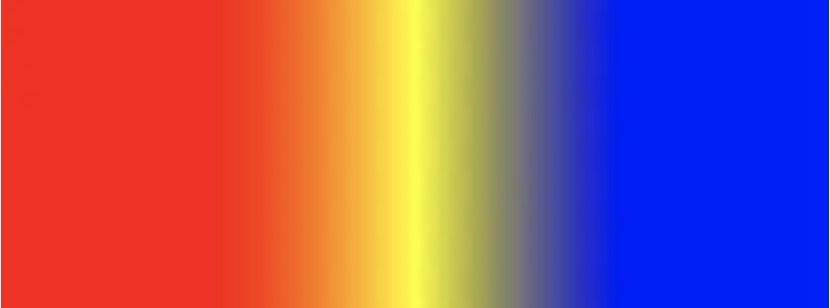

# CALayer

##### 1.CAGradientLayer：渐变处理

```swift
override func viewDidLoad() {
        super.viewDidLoad()
        // Do any additional setup after loading the view, typically from a nib.
        
        self.view.backgroundColor = UIColor.white
        
        let gradientLayer = CAGradientLayer()
        gradientLayer.frame = self.view.bounds
        self.view.layer.addSublayer(gradientLayer)
        
        // 颜色分配
        gradientLayer.colors = [
            UIColor.red.cgColor,
            UIColor.yellow.cgColor,
            UIColor.blue.cgColor
        ]
        /*
         // 颜色分布：
         从0到第一个值，保持第一种颜色；
         从最后一个值到1，保持最后一种颜色；
         从n->n+1，完成从 第n个颜色 到 第n+1个颜色 的变换；
         */
        let arr = [
            0.25,
            0.5,
            0.75
        ]
        gradientLayer.locations = arr as [NSNumber]?
        
        // 下面两个参数是：开始点，结尾点；两点之间的连线可以形成一个矢量方向，即是渐变的方向
        gradientLayer.startPoint = CGPoint.init(x: 0, y: 0) // 左上角
        gradientLayer.endPoint = CGPoint.init(x: 1, y: 0) // 右上角
  		  // 注意：point值可以传负数
   }
```

效果如下图：



##### CAGradientLayer的添加：

1.add或使用insertSublayer调整位置，注意直接add会覆盖掉view的子视图。因此使用

view.insertSublayer(layer, at: 0)，可以在不影响子视图的情况下，只对view做渐变处理

2.为其frame赋值，一般赋为view.bounds就可以了