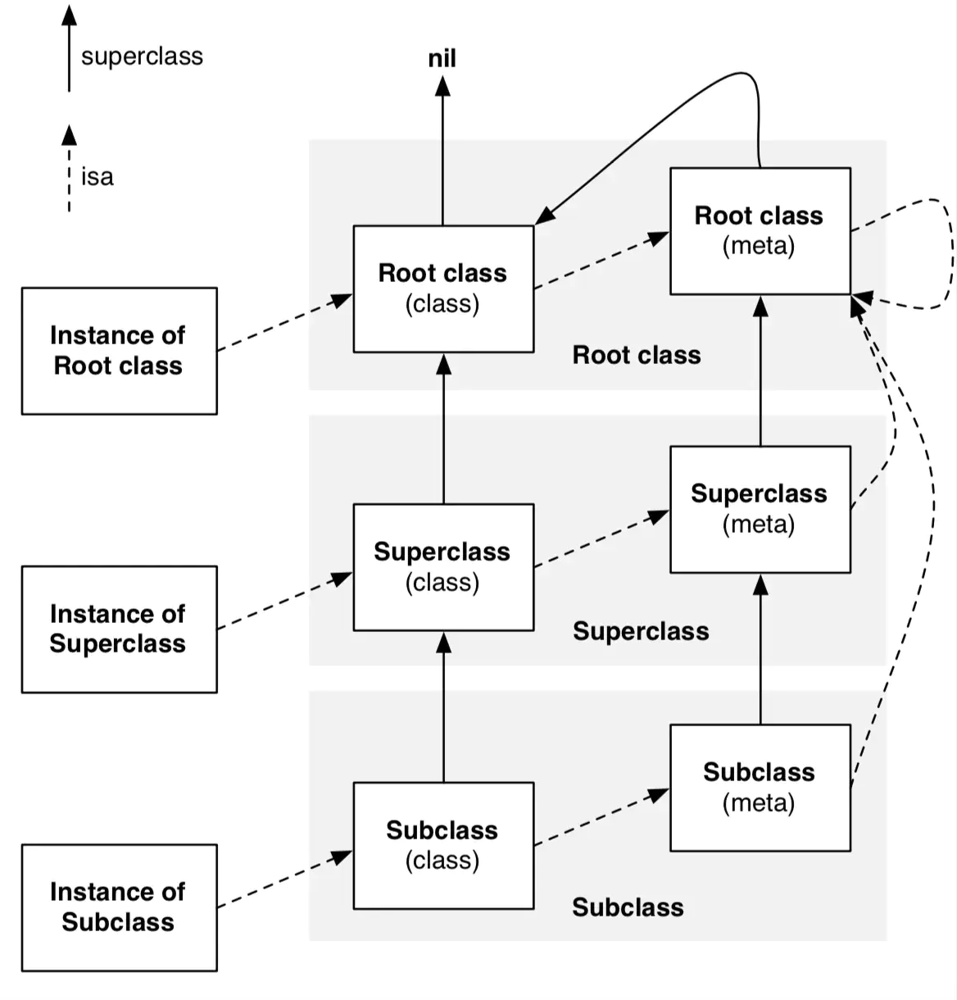
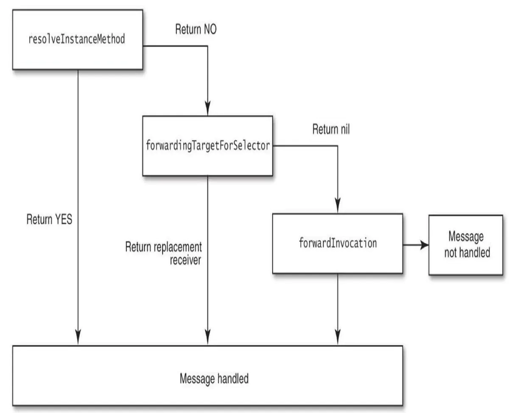

## OC中的消息

### 对象，类的定义

OC中对象的定义：

```cpp
/// An opaque type that represents an Objective-C class.
typedef struct objc_class *Class;
 
/// Represents an instance of a class.
struct objc_object {
    Class _Nonnull isa  OBJC_ISA_AVAILABILITY;
};
 
/// A pointer to an instance of a class.
typedef struct objc_object *id;
```

可以看到：

1.对象是结构体，代表一个类的实例，它只包含一个成员变量，即一个isa指针，该指针指向该实例的类。

2.id类型就是指向类实例的指针


OC中对类的定义

```cpp
/// An opaque type that represents an Objective-C class.
typedef struct objc_class *Class;

struct objc_class {
    Class _Nonnull isa  OBJC_ISA_AVAILABILITY;

#if !__OBJC2__
    Class _Nullable super_class                              OBJC2_UNAVAILABLE;
    const char * _Nonnull name                               OBJC2_UNAVAILABLE;
    long version                                             OBJC2_UNAVAILABLE;
    long info                                                OBJC2_UNAVAILABLE;
    long instance_size                                       OBJC2_UNAVAILABLE;
    struct objc_ivar_list * _Nullable ivars                  OBJC2_UNAVAILABLE;
    struct objc_method_list * _Nullable * _Nullable methodLists                    OBJC2_UNAVAILABLE;
    struct objc_cache * _Nonnull cache                       OBJC2_UNAVAILABLE;
    struct objc_protocol_list * _Nullable protocols          OBJC2_UNAVAILABLE;
#endif

} OBJC2_UNAVAILABLE;
```

可以看到：

1.类也是一个对象，它包含isa指针，该指针指向元类

2.类的成员变量还有类名，父类指针，方法缓存等。


### 发送消息

对方法的调用会转化为objc_msgsend(obj,name);其中obj为调用的对象，name为方法名。

```
方法调用的过程--调用实例方法
1.通过对象的isa指针找到该类
2.去类的缓存`cache`里找方法，找到则执行。
3.若没找到，则去类的方法列表`method_list`里找，找到则执行。
3.还没找到，说明这个类自己没有了，就会通过`super_class`去父类里找。
4.如果从父类一直到根类还没找到，那么就是没有了，会转向一个拦截调用的方法，可以自己在拦截调用方法里面做一些处理。
5.如果没有在拦截调用里做处理，那么就会报错崩溃。
```

```
方法调用的过程--调用类方法
1.通过类的isa指针找到该类的元类
2.去元类的缓存`cache`里找方法，找到则执行。
3.若没找到，则去元类的方法列表`method_list`里找，找到则执行。
3.还没找到，说明这个类自己没有了，就会通过`super_class`去父类的元类里找。
4.如果从父类的元类一直到根元类还没找到（根元类继承于NSObject），那么就是没有了，会转向一个拦截调用的方法，可以自己在拦截调用方法里面做一些处理。
5.如果没有在拦截调用里做处理，那么就会报错崩溃。
```




### 消息转发(message forwarding)



方案一：


```css
+ (BOOL)resolveInstanceMethod:(SEL)sel

+ (BOOL)resolveClassMethod:(SEL)sel
```

首先，系统会调用**`resolveInstanceMethod`**(当然，如果这个方法是一个类方法，就会调用**`resolveClassMethod`**)让你自己为这个方法增加实现。

demo1:

定义一个Person,创建了一个Person类的对象p，然后调用p的run方法，注意，这个run方法是没有写实现的。


```csharp
Person *p = [Person alloc] init];
[p run];
```

进入Person类的.m文件，我实现了**`resolveInstanceMethod`**这个方法为我的Person类动态增加了一个run方法的实现。


```objectivec
void run (id self, SEL _cmd) {

    NSLog(@"跑");
}

+ (BOOL)resolveInstanceMethod:(SEL)sel {
    
    if（sel == @selector(run)）{
        class_addMethod(self, sel, (IMP)run, "v@:");
        return YES;
    }
    return [super resolveInstanceMethod:sel];
}
```

方案二：


```css
- (id)forwardingTargetForSelector:(SEL)aSelector
```

第二套方法，**`forwardingTargetForSelector`**，这个方法返回你需要转发消息的对象。

demo2:

为了便于演示消息转发，我们新建了一个汽车类Car，并且实现了Car的run方法。

现在我不去对方案一的resolveInstanceMethod做任何处理，直接调用父类方法。可以看到，系统已经来到了**`forwardingTargetForSelector`**方法，我们现在返回一个Car类的实例对象。


```kotlin
- (id)forwardingTargetForSelector:(SEL)aSelector {
    return [[Car alloc] init];  
}
```

继续运行，程序就来到了Car类的run方法，这样，我们就实现了消息转发。

方案三：


```objectivec
- (NSMethodSignature *)methodSignatureForSelector:(SEL)selector;

- (void)forwardInvocation:(NSInvocation *)invocation;
```

**`methodSignatureForSelector`**用来生成方法签名，这个签名就是给**`forwardInvocation`**中的参数**`NSInvocation`**调用的。

开头我们要找的错误`unrecognized selector sent to instance`原因，原来就是因为**`methodSignatureForSelector`**这个方法中，由于没有找到run对应的实现方法，所以返回了一个空的方法签名，最终导致程序报错崩溃。

所以我们需要做的是自己新建方法签名，再在**`forwardInvocation`**中用你要转发的那个对象调用这个对应的签名，这样也实现了消息转发。


```objectivec
- (NSMethodSignature *)methodSignatureForSelector:(SEL)selector {

    NSString *sel = NSStringFromSelector(selector);
    if([sel isEqualString:@"run"]) {
        return [NSMethodSignature signatureWithObjcTypes:"v@:"];
    }
    return [sunper methodSignatureForSelector:selector];
}


- (void)forwardInvocation:(NSInvocation *)invocation {

    SEL selector = [invocation selector];
    //新建需要转发消息的对象
    Car *car = [[Car alloc] init];
    if([car respondsToSelector:selector]){
        [invocation invokeWithTarget:car];
    }
}

关于生成签名的类型"v@:"解释一下。每一个方法会默认隐藏两个参数，self、_cmd，self代表方法调用者，_cmd代表这个方法的SEL，签名类型就是用来描述这个方法的返回值、参数的，v代表返回值为void，@表示self，:表示_cmd。
注意一点，前一套方案实现后一套方法就不会执行。如果这几套方案你都没有做处理，那么程序就会报错crash。
```

